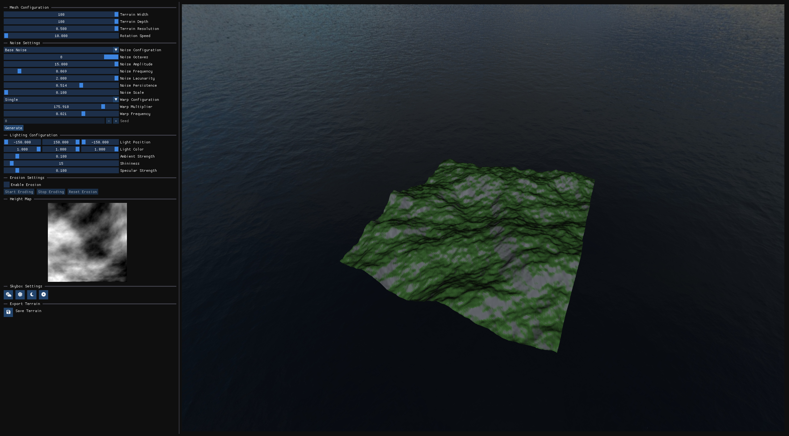
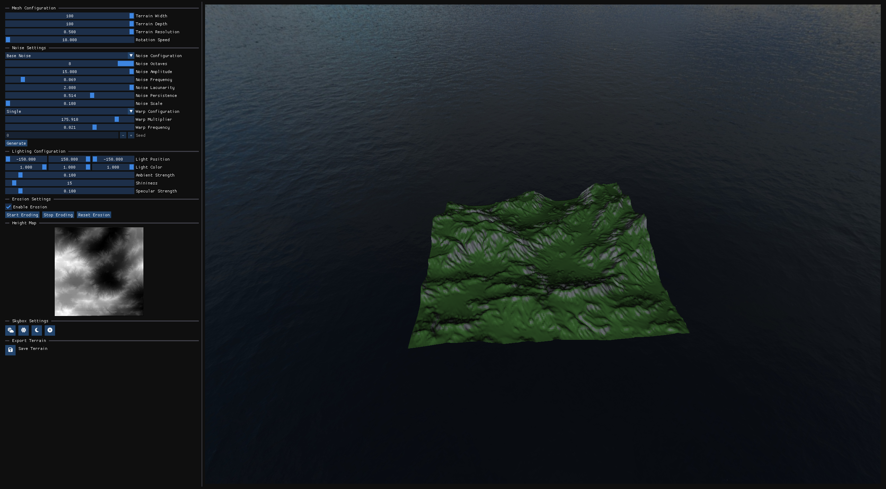
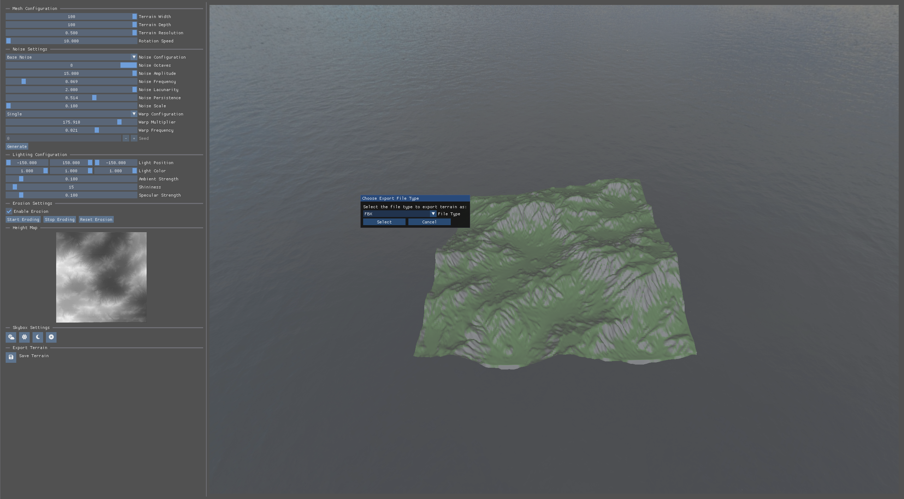

<h1 align="center">Lightweight Procedural Terrain Generator </h1>
<p align="center"> 
    
</p>
<p>
    This project is a lightweight desktop application capable of procedurally generating 3D landscapes in real time. Built upon <strong>OpenGL</strong>, <strong>ImGUI</strong> and <strong>C++</strong> the application provides various different features required to create 3D landscapes including:
</p>

| Feature | Description |
|--------|-------------|
| Interactive Editor | User interface contains and editor that allows the user to fully control noise, erosion and other variables in terrain generation |
| Real-Time Rendering of Viewport | Viewport displays a 3D Scene in real-time |
| Heightmap Rendering | User interface displays a real-time display of the current heightmap |
| File Exportation | Terrain mesh can be exported to two different formats including **.FBX** and **.OBJ** |
| Seeding | Noise seed can be changed by the user to update the randomness of the noise and erosion |
| Perlin Noise Based Generation | Terrain mesh is applied with Perlin Noise and allows for adjustable **fBM noise** |
| Simulated Hydraulic Erosion | Hydraulic erosion is simulated and can be paused and resumed on demand. It can also be reset  |
| Lighting Control | Scene lighting can be controlled to adjust colour, position, direction. By using phong based lighting specular, ambient and shininess can be controlled too |
| Skybox Control | The Skybox can be changed too different times of day or disabled |
| Real-Time Performance | This application takes advantage of multithreading to conduct procedural generation and mesh creation operations |

## Screenshots
### User Interface


### Erosion applied on Terrain Mesh


### Exportation


## Build Instructions
### Install Prerequisites
To use this application you need to install:

- Up to date GPU Drivers
- Visual Studio 2026 *(Recommended)* or Visual Studio 2022 *(Requires Configuration)*
- Visual Studio Components: <br>
    1. Desktop Development with C++
    2. MSVC v143 (or newer) C++ Compiler
    3. Windows 10/11 SDK

## System Requirements
- Windows 10 / Windows 11 (64-bit)
- GPU with OpenGL 3.3 support or higher
- 8GB RAM *(recommended)*
- Multi-core CPU *(recommended)*

### Clone Repository
```bash
git clone https://github.com/user/FYP-Terrain-Generator-Application.git
cd FYP-Terrain-Generator-Application
```

### Building the project (Visual Studio 2026 - Recommended)
1. Open the Project folder
2. Open the ```.sln``` file using **Visual Studio 2026**
3. Ensure build configuration is set to
```
Debug
x64
```
4. Click Build
5. The executable will be generated in:
```
/x64/Debug/
```

### Building the project (Visual Studio 2022)
1. Open the Project folder
2. Open the ```.sln``` file using **Visual Studio 2022**
3. Ensure build configuration is set to
```
Debug
x64
```
4. In solution explorer right click on the ```FYP-Terrain-Generator-Application``` project
5. Click **Properties**
6. Under **Platform Toolset** change the current version of MSVC (v145) to **v143** (If not available v143 must be installed)
7. Click Build
8. The executable will be generated in:
```
/x64/Debug/
```